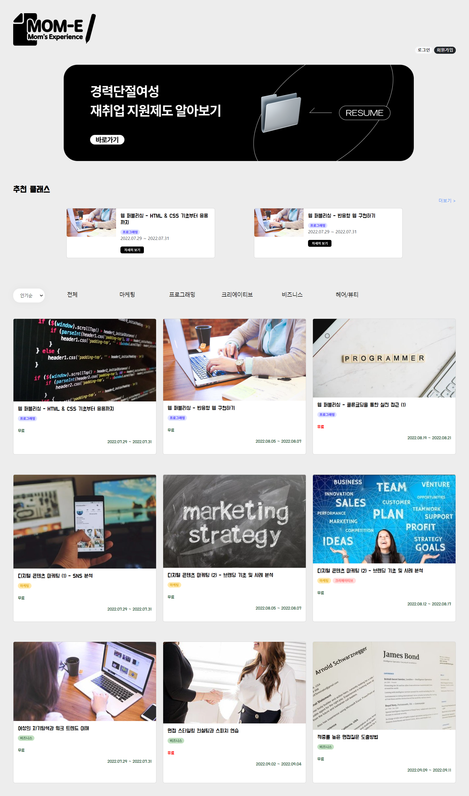

# MOM-E

 

## 여기톤이란?

이번 해커톤은 서울권 6개의 여대(덕성여대, 동덕여대, 서울여대, 성신여대, 숙명여대, 이화여대)가 함께 진행하는 **“여기톤:HERETHON”** 입니다.
여기톤은 2019년부터 매 해 진행되어 왔으며 2022 여기톤은 7월 29일 19:00 ~ 7월 30일 09:00 무박 2일로 진행됩니다.
행사 기간 동안 각 학교의 한 명씩 6명이 한 팀을 이뤄 하루 사이에 집중적으로 개발을 진행하여 하나의 서비스를 만들어 냅니다.

서울권 6개의 여자대학교 학생 약 120명이 참가하는 행사로
여성 예비 개발자 간의 커넥션 형성과 팀 프로젝트를 통한 
각 개인의 개발 역량 강화를 목적으로 하며 
해당 행사를 통해 여성들에게 더 많은 기회와 경험의 자리를 제공하고자 합니다.

 

## 기획 배경

> 경력 공백기간을 유의미한 경험으로 채워나갈 수 있도록

경력단절여성들의 취업이 제한되는 이유는 대부분의 기업들이 바로 실무에 투입될 수 있는 인재를 원하기 때문입니다.  
그러나 결혼 후 육아 등으로 생겨나는 경력 공백이 경력단절여성들의 취업에 불리한 요소로 작용하고 있습니다.  

아러한 경력 공백을 유리한 요소로 바꾸기 위해서는 경력 공백기간동안 유의미한 경험을 하는 것이 중요합니다.  

**MOM-E**는 이러한 배경에서 탄생했습니다.  
경력단절여성들에게 다양한 경험을 제공할 뿐만 아니라  
재취업 시에 활용할 수 있도록 경험을 데이터화하는 오프라인 클래스 플랫폼입니다.  

 

## 기술 스택

### FrontEnd
- HTML
- CSS
- Javascript

### BackEnd 🖐️ 
- Python
- Django
- SQLite

### Colaboration
- Git (Github, GitKraken)
- Notion

 

## 화면 소개 

### 메인화면

- 경력단절여성만을 위한 오프라인 클래스 모아보기 
- 경력단절여성만을 위한 오프라인 교육 프로그램을 모아볼 수 있을 뿐만 아니라 **필터**를 통해 원하는 분야의 프로그램만 확인할 수 있습니다. 

 

### 클래스 상세화면

- 클래스의 상세 정보를 확인할 수 있습니다.
- 오프라인 교육 프로그램을 모아보는 데에서만 그치지 않고 참여하고 싶은 오프라인 클래스가 있다면 바로 참여 신청을 할 수 있습니다.

 

### 마이페이지

- 마이페이지에서 내가 참여한 클래스를 모아볼 수 있습니다.
- 클래스 후기를 작성하거나 조회하여 나의 경험을 재취업 시 증명 가능한 데이터로 만들 수 있습니다.
- 클래스에 참여할 때마다 마미 포인트를 쌓으며 경력개발기간을 더욱 즐겁게 보낼 수 있습니다.

 
